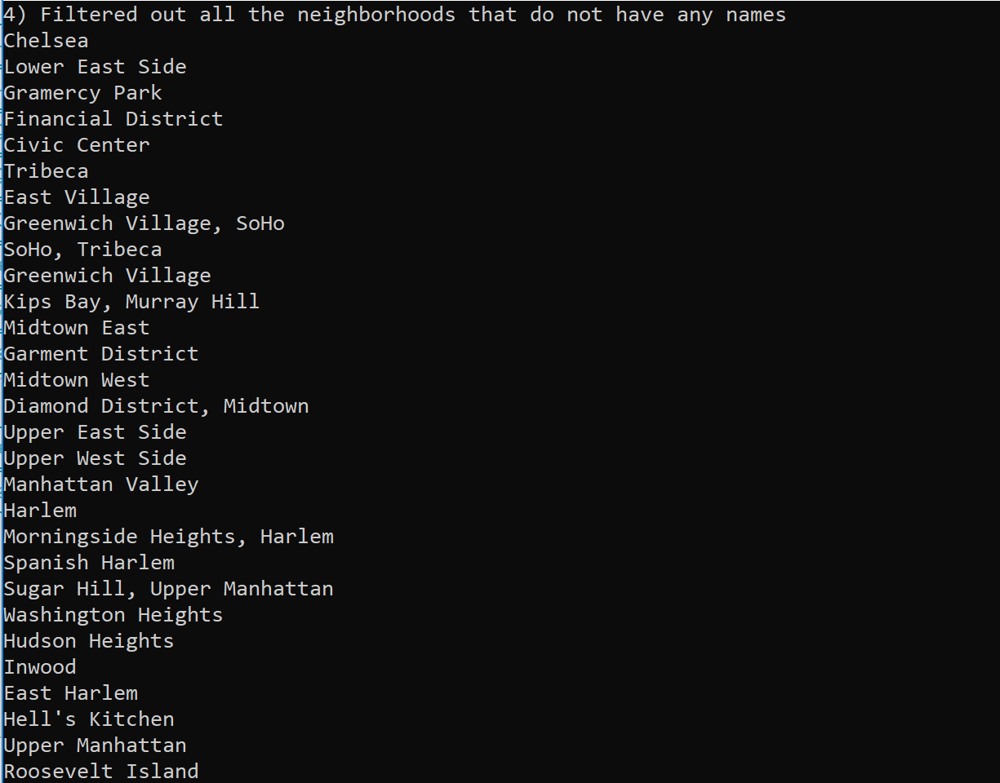

# LAB08-LINQinManhatten
This is a .NET Core 2.1 Console Application written in C#. The purpose of this application is to practice converting json files to c# using newtonsoft NuGet package and familarize with lamba and LINQ queries. For this project, I Output all of the neighborhoods in this data list, Filter out all the neighborhoods that do not have any names, Removed the Duplicates, rewrote the queries and consolidate all into one single query, then rewrote one of these questions only using the opposing method (example: Use LINQ instead of a Lambda and vice versa.)
## Sample View

## Load Application
in terminal: git clone open in visual studio run project without debugging
## License 
This project is licensed under the MIT license.
